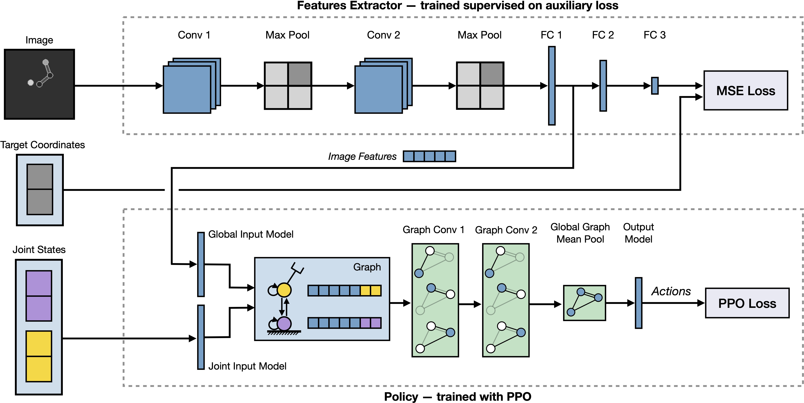

## Graph Neural Networks for Relational Inductive Bias in Vision-based Deep Reinforcement Learning of Robot Control

  <h3>Marco Oliva, Soubarna Banik, Josip Josifovski and Alois Knoll</h3>
  
  <h5>Technical University of Munich, Germany 
  Email: {marco.oliva, soubarna.banik, josip.josifovski}@tum.de, knoll{at}in.tum.de</h5>

State-of-the-art reinforcement learning algorithms predominantly learn a policy either from a numerical state vector or from images. Both approaches generally do not take structural knowledge of the task into account. This is especially prevalent in robotic applications and can benefit learning if exploited. This work introduces a neural network architecture that combines relational inductive bias and visual feedback to learn an efficient position control policy for robotic manipulation. We derive a graph representation that models the physical structure of the manipulator and combines the robot's internal state with a low-dimensional description of the visual scene generated by an image encoding network. On this basis, a graph neural network trained with reinforcement learning predicts joint velocities to control the robot. We further introduce an asymmetric approach to train the image encoder separately from the policy using supervised learning. Experimental results demonstrate that, for a 2-DoF planar robot in a geometrically simplistic 2D environment, a learned representation of the visual scene can replace access to the explicit coordinates of the reaching target without compromising on the quality and sample efficiency of the policy. We further show the ability of the model to improve sample efficiency for a 6-DoF robot arm in a visually realistic 3D environment.

 

 

### Code
Check out the repository to view the source code, reproduce the results, or train your own models.

### Contributions
We identify a blind spot in the reinforcement learning research as, to our knowledge, there exists no method for inducing a relational bias into a vision-based reinforcement learning system. For this reason, we explore and present a graph neural network model that integrates structural knowledge with image observations and apply it to learn an efficient position control policy for robotic manipulation using reinforcement learning.

To this end, we make the following contributions:
* We introduce a new architecture that combines an image encoding network with a lightweight graph network to learn an efficient control policy.
* We show that the relational inductive bias introduced by applying a graph neural network to the graph representation of the robot's state can reduce the sample complexity when training RL agents for robot control without compromising quality.
* We present a method to iteratively train an image encoding network for image representation learning based on optimizing an auxiliary loss from data generated by the policy.

### Methods
We aim to learn an efficient robot control policy from visual observations of the environment and the robot’s readily available internal state information. The model learns to act in an environment by visually detecting relevant properties, without requiring explicit knowledge of their state at inference time. The method can be split into three aspects: (1) extracting task-relevant information from the visual scene; (2) combining the extracted visual information with the internal state information of the robot and processing it in a structured way; (3) learning a control policy for a specific robotic task that maximizes a task-specific reward function. To achieve this, we combine an image encoding network with a policy graph network. The image encoding network learns a transformation of an image of the environment into a low-dimensional image feature vector. The policy graph network learns the control policy from the image feature vector and the robot’s internal states using reinforcement learning.

We evaluate our approach on the problem of robotic position control, which entails deriving the inverse kinematics for a robotic manipulator together with a control policy. Starting from an initial robot configuration and a random target position, we train a model that commands joint velocities to move the end-effector of the manipulator to a specified target position. For this, we use two stimulation environments to train and evaluate the model under different levels of environmental complexity.

### Acknowledgements
This work has been financially supported by AI4DI project, which
has received funding from the ECSEL Joint Undertaking (JU) under grant
agreement No 826060. The JU receives support from the European Union’s
Horizon 2020 research and innovation programme and Germany, Austria,
Czech Republic, Italy, Latvia, Belgium, Lithuania, France, Greece, Finland,
Norway.
